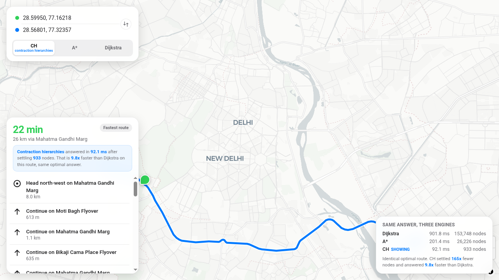

# Meridian

A routing engine on real map data. An OpenStreetMap extract of Delhi is parsed
into a road graph, three shortest-path engines are implemented from scratch -
Dijkstra, A*, and contraction hierarchies - and a MapLibre UI wraps it with
draggable waypoints and turn-by-turn directions.

**Live:** https://meridian-nveb.onrender.com



## What it does

- Drag two pins anywhere in Delhi. Meridian snaps them to the road network and
  returns the optimal driving route with turn-by-turn steps.
- Pick your engine: **contraction hierarchies**, **A***, or **Dijkstra**. Every
  engine returns the identical optimal answer - the difference is how much of
  the graph they had to look at, and the UI shows it live.
- The API can run all three on the same query (`compare=1`) so the comparison
  is apples to apples.

## Measured performance

Benchmark: 30 random node pairs at least 40 km apart (straight line), run by
`npm run benchmark` against the committed graph. All three engines returned the
identical optimal cost on all 30 pairs.

| engine | avg query | p95 query | nodes settled (avg) |
| --- | --- | --- | --- |
| Dijkstra | 167.5 ms | 194.3 ms | 280,568 |
| A* | 143.3 ms | 213.8 ms | 169,594 |
| Contraction hierarchies | **2.83 ms** | 6.01 ms | 1,167 |

Contraction hierarchies answer **59x** faster than Dijkstra (51x than A*)
while settling **240x** fewer nodes. Dijkstra and A* numbers include the
admissible-goal check; CH numbers include shortcut unpacking for the full
route geometry.

## How it works

```
BBBike NewDelhi.osm.pbf (37 MB, OpenStreetMap data)
  -> scripts/build_graph_osmium.py   two low-memory pyosmium passes: drivable
                                     ways + node coords, then segment chaining:
                                     intersections become graph nodes, straight
                                     runs compress into weighted edges
                                     (weight = drive time)
  -> scripts/build_graph.py finish   largest connected component, coord
                                     compaction -> data/graph.bin (custom CSR)
  -> scripts/build_ch.js             contraction hierarchies preprocessing:
                                     nodes ordered by importance, shortcuts
                                     added, ranks serialized -> data/ch.bin
  -> server/index.js                 loads both, answers /api/route in ms
```

- **Graph**: 280,227 nodes and 719,351 directed edges over Delhi NCT. Edge
  weights are drive time (haversine distance / per-class speed); one-way tags
  and access restrictions respected; largest connected component kept.
- **Dijkstra** settles nodes in cost order until the target pops - correct,
  and on a regional graph it looks at most of the map.
- **A*** adds an admissible heuristic (straight-line distance / 100 km/h),
  steering the search toward the target without changing the answer.
- **Contraction hierarchies** preprocess the graph once: contract unimportant
  nodes first, adding shortcut edges that preserve all shortest paths (about a
  million of them here). Queries scan only "upward" edges from both ends and
  meet in the middle - a few hundred settled nodes instead of the whole map.
  Shortcuts unpack back into real road geometry for rendering.

## API

`GET /api/route?from=LAT,LON&to=LAT,LON&algo=ch|astar|dijkstra[&compare=1]`

Returns distance, drive time, the route polyline, turn-by-turn steps, and per
engine query time + settled-node counts. `GET /api/meta` returns graph stats
and the benchmark summary served to the UI.

## Run it locally

```bash
npm install
npm start          # serves UI + API on :3000 (data/ is committed)
```

Rebuild the graph from scratch:

```bash
pip install osmium
# download https://download.bbbike.org/osm/bbbike/NewDelhi/NewDelhi.osm.pbf into data/
npm run build:graph
npm run build:ch
npm run benchmark
```

## Stack

Plain JavaScript end to end: Node + Express API, vanilla JS + MapLibre GL
frontend, Python (pyosmium) for the one-time PBF pipeline. No framework, no
TypeScript, no paid services. Map tiles by CARTO, data (c) OpenStreetMap
contributors.
